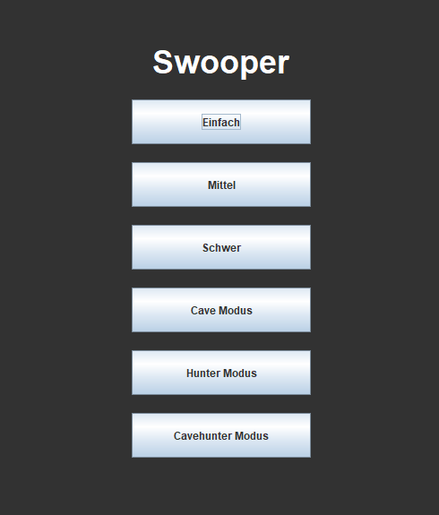
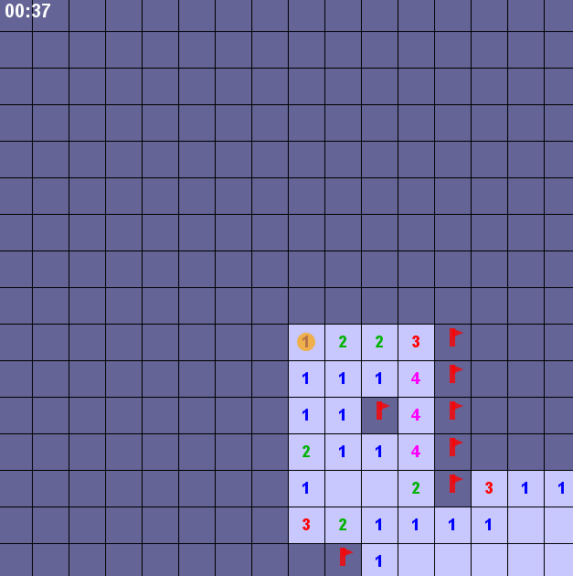
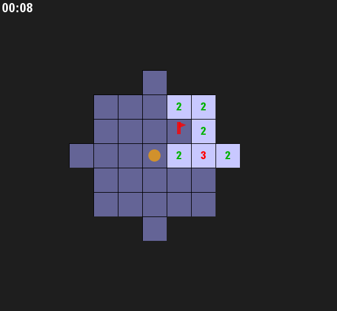
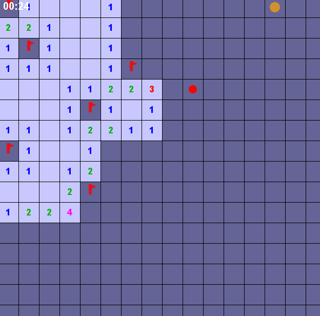
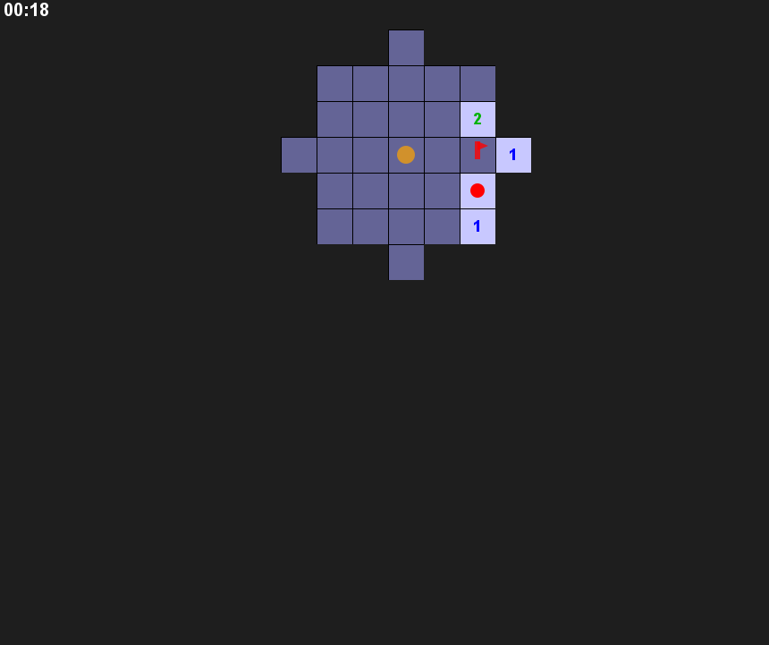

 

**Programmierer:** Leon Schumacher 

Swooper ist eine neue Minesweeper-Variante in Java. Du steuerst einen Spieler über ein Raster und musst Minen finden, Flaggen setzen und strategisch vorgehen.

## Spielmodi:

<b></b>Einfach, Mittel, Schwer</b> – Klassische Minesweeper-Layouts mit steigender Schwierigkeit   

<b></b>Cave Modus</b> – Sicht nur in begrenztem Radius

<b>Hunter Modus</b> – Ein Hunter verfolgt den Spieler   

<b>Cavehunter Modus</b> – Kombination aus Cave Modus und Hunter Modus   

## Steuerung
Pfeiltasten: Spieler bewegen  
SPACE: Feld aufdecken  
F: Flagge setzen/entfernen  
ESC: Zurück zum Hauptmenü
